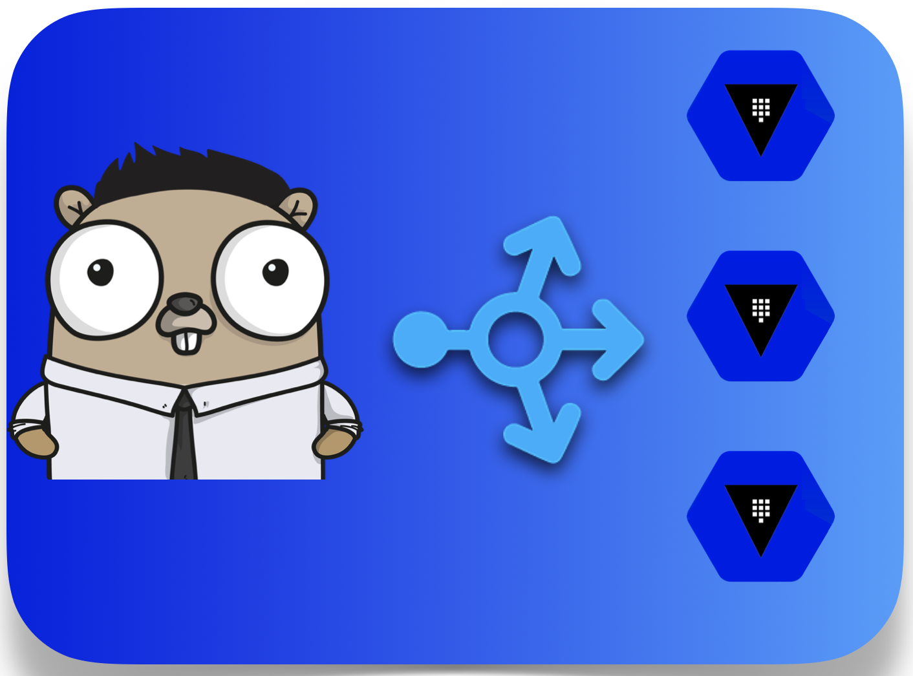

# Vault Load Balancer

*Vault Load Balancer(VLB)* is a simple load balancer written in GoLang to help get HA of the Open Source Vault.

## TLDR;
To know more on how to use *Vault Initializer* and *Vault Load Balancer* head over to this [How to make Vault Highly Available on NFS](https://medium.com/@github.gkarthiks/how-to-make-opensource-vault-highly-available-on-nfs-5af0c68070d8) article on Medium.

## How does it work
The VLB is based on round robin mechanism. Collects all the Vault Pod IP addresses by matching the label selector. Adds it to the list of available services.

Using the seal-status API of Vault, determines the availability of the vault pod. If a vault pod is available, and the seal-status of the pod is `unsealed`, then the corresponding pod will be marked alive and made available for queries.

## How to use VLB

To make use of VLB, the vault pods must be already initialized and unsealed. DIY initialization and unsealing or you can also use the [Vault Initializer](https://github.com/gkarthiks/vault-initializer). After doing so, deploy the VLB to achieve the HA of the vault pods.

## Roadmap:
- Add vault-initializer as a go routine within VLB to reduce the resource cost.
- Make VLB to use a shared location for holding the list of services and statuses 
